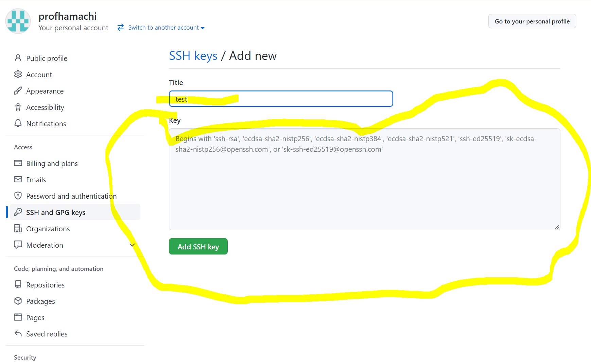
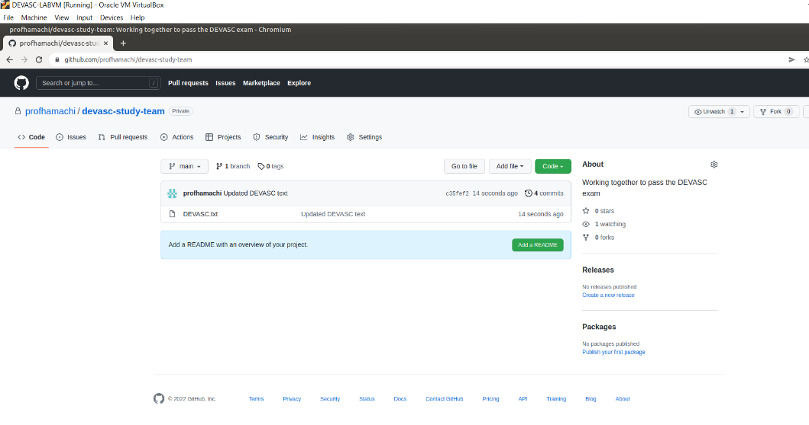

# 3.3.11 Lab - Software Version Control with Git v2023 Update

## Video Walkthrough
[YouTube Link to Video Tutorial](https://youtu.be/aY7WRzYIKiI)

## Objectives
- Part 1: Launch the DEVASC VM
- Part 2: Initializing Git
- Part 3: Staging and Committing a File in the Git Repository
- Part 4: Managing the File and Tracking Changes
- Part 5: Branches and Merging
- Part 6: Handling Merge Conflicts
- Part 7: Integrating Git with GitHub

## Background / Scenario
In this lab, you will explore the fundamentals of the distributed version control system Git, including most of the features you need to know in order to collaborate on a software project. You will also integrate your local Git repository with the cloud-based GitHub repository.  
Required Resources
•	1 PC with operating system of your choice
•	Virtual Box or VMWare
•	DEVASC Virtual Machine

## Instructions
### Part 1: Launch the DEVASC VM
If you have not already completed the Lab - Install the Virtual Machine Lab Environment, do so now. If you have already completed that lab, launch the DEVASC VM now.

### Part 2: Initializing Git 
In this part, you will initialize a Git repository.

#### Step 1: Open a terminal in the DEVASC-LABVM.
Double-click the Terminal Emulator icon on the desktop.
#### Step 2: Initialize a Git Repository.
a.	Use the ls command to display a listing of the current directory. Remember that commands are case-sensitive.
```console
devasc@labvm:~$ ls
Desktop    Downloads  Music     Public  Templates
Documents  labs       Pictures  snap    Videos
devasc@labvm:~$ 
```
b.	Next, configure user information to be used for this local repository. This will associate your information the work that you contribute to a local repository. Use your name in place of "Sample User" for the name in quotes " ". Use @example.com for your email address.
Note: These settings can be anything you want at this point. However, when you reset these global values in Part 7, you will use the username for your GitHub account. If you wish, you can use your GitHub username now.
```console
devasc@labvm:~$ git config --global user.name "SampleUser"
devasc@labvm:~$ git config --global user.email sample@example.com
```
c.	At any time, you can review these setting with the git config --list command.
```console
devasc@labvm:~$ git config --list
user.name=SampleUser
user.email=sample@example.com
devasc@labvm:~$
```
d.	Use the cd command to navigate to the devnet-src folder:
```console
devasc@labvm:~$ cd labs/devnet-src/
devasc@labvm:~/labs/devnet-src$
```
e.	Make a directory git-intro and change directory into it:
```console
devasc@labvm:~/labs/devnet-src$ mkdir git-intro
devasc@labvm:~/labs/devnet-src$ cd git-intro
devasc@labvm:~/labs/devnet-src/git-intro$
```
f.	Use the git init command to initialize the current directory (git-intro) as a Git repository. The message displayed indicates that you have created a local repository within your project contained in the hidden directory .git. This is where all of your change history is located. You can see it with the ls -a command.
```console
devasc@labvm:~/labs/devnet-src/git-intro$ git init
Initialized empty Git repository in /home/devasc/labs/devnet-src/git-intro/.git/
devasc@labvm:~/labs/devnet-src/git-intro$ ls -a
.  ..  .git
devasc@labvm:~/labs/devnet-src/git-intro$
```
g.	As you work on your project, you will want to check to see which files have changed. This is helpful when you are committing files to the repo, and you don't want to commit all of them. The git status command displays modified files in working directory that are staged for your next commit.
This message tells you: 
•	That you are on branch master. (Branches are discussed later in this lab)
•	The commit message is Initial commit.
•	There is nothing changed to commit.
You will see that the status of your repo will change once you add files and start making changes.

```console
devasc@labvm:~/labs/devnet-src/git-intro$ git status
On branch master

No commits yet

nothing to commit (create/copy files and use "git add" to track)
devasc@labvm:~/labs/devnet-src/git-intro$
```
### Part 3: Staging and Committing a File in the Repository
In this part you will create a file, stage that file, and commit that file to the Git repository. 
#### Step 1: Create a file.
a.	The git-intro repository is created but empty. Using the echo command, create the file DEVASC.txt with the information contained in quotes.
```console
devasc@labvm:~/labs/devnet-src/git-intro$ echo "I am on my way to passing the Cisco DEVASC exam" > DEVASC.txt
devasc@labvm:~/labs/devnet-src/git-intro$
```
b.	Use the ls -la command terify the file, as well as the .git directory, are in the git intro directory.  Then use cat to display the contents of DEVASC.txt.
```console
devasc@labvm:~/labs/devnet-src/git-intro$ ls -la
total 16
drwxrwxr-x 3 devasc devasc 4096 Apr 17 20:38 .
drwxrwxr-x 5 devasc devasc 4096 Apr 17 19:50 ..
-rw-rw-r-- 1 devasc devasc   48 Apr 17 20:38 DEVASC.txt
drwxrwxr-x 7 devasc devasc 4096 Apr 17 19:57 .git
evasc@labvm:~/src/git-intro$ cat DEVASC.txt
I am on my way to passing the Cisco DEVASC exam
devasc@labvm:~/labs/devnet-src/git-intro$
```
#### Step 2: Examine the Repository Status.
Examine the repository status using git status. Notice that Git found the new file in the directory, and knows that it's not tracked.
```console
devasc@labvm:~/labs/devnet-src/git-intro$ git status
On branch master

No commits yet

Untracked files:
  (use "git add <file>..." to include in what will be committed)
	DEVASC.txt

nothing added to commit but untracked files present (use "git add" to track)
devasc@labvm:~/labs/devnet-src/git-intro$
```
#### Step 3: Staging the File.
a.	Next, use the git add command to "stage" the DEVASC.txt file. Staging is an intermediate phase prior to committing a file to the repository with the git commit command. This command creates a snapshot of the contents of the file at the time this command is entered. Any changes to the file require another git add command prior to committing the file.
```console
devasc@labvm:~/labs/devnet-src/git-intro$ git add DEVASC.txt
```
b.	Using the git status command again, notice the staged changes displayed as "new file: DEVASC.txt".

```console
devasc@labvm:~/labs/devnet-src/git-intro$ git status
On branch master

No commits yet

Changes to be committed:
  (use "git rm --cached <file>..." to unstage)
	new file:   DEVASC.txt

devasc@labvm:~/labs/devnet-src/git-intro$
```
#### Step 4: Committing a File.
Now that you have staged your changes, you will need to commit them in order to let Git know you want to start tracking those changes. Commit your staged content as a new commit snapshot by using the git commit command. The -m message switch enables you to add a message explaining the changes you've made. Note the number and letter combination highlighted in the output. This is the commit ID. Every commit is identified by a unique SHA1 hash. The commit ID is the first 7 characters of the full commit hash. Your commit ID will be different than the one displayed.
```console
devasc@labvm:~/labs/devnet-src/git-intro$ git commit -m "Committing DEVASC.txt to begin tracking changes"
[master (root-commit) b510f8e] Committing DEVASC.txt to begin tracking changes
 1 file changed, 1 insertion(+)
 create mode 100644 DEVASC.txt
devasc@labvm:~/labs/devnet-src/git-intro$
```
#### Step 5: Viewing the Commit History.
Use the git log command to show all commits in the current branch's history. By default, all commits are made to the master branch. (Branches will be discussed later.) The first line is the commit hash with the commit ID as first 7 characters. The file is committed to the master branch. This is followed by your name and email address, the date of the commit and the message you included with the commit.
devasc@labvm:~/labs/devnet-src/git-intro$ git log
commit b510f8e5f9f63c97432d108a0413567552c07356 (HEAD -> master)
Author: Sample User <sample@example.com>
Date:   Sat Apr 18 18:03:28 2020 +0000

    Committing DEVASC.txt to begin tracking changes
devasc@labvm:~/labs/devnet-src/git-intro$ 
### Part 4: Modifying the File and Tracking the Changes
In this part, you will modify a file, stage the file, commit the file, and verify changes in the repository.
#### Step 1: Modify the file.
a.	Make a change to DEVASC.txt using the echo command. Be sure to use ">>" to append the existing file. The ">" will overwrite the existing file. Use the cat command to view the modified file.
```console
devasc@labvm:~/labs/devnet-src/git-intro$ echo "I am beginning to understand Git!" >> DEVASC.txt
```
b.	Use the cat command to view the modified file.
```console
devasc@labvm:~/labs/devnet-src/git-intro$ cat DEVASC.txt
I am on my way to passing the Cisco DEVASC exam
I am beginning to understand Git!
devasc@labvm:~/labs/devnet-src/git-intro$
```
#### Step 2: Verify the change to the repository.
Verify the change in the repository using the git status command.
```console
devasc@labvm:~/labs/devnet-src/git-intro$ git status
On branch master
Changes not staged for commit:
  (use "git add <file>..." to update what will be committed)
  (use "git restore <file>..." to discard changes in working directory)
	modified:   DEVASC.txt

no changes added to commit (use "git add" and/or "git commit -a")
devasc@labvm:~/labs/devnet-src/git-intro$
```
#### Step 3: Stage the modified file.
The modified file will need to be staged again before it can be committed using the git add command again. 
```console
devasc@labvm:~/labs/devnet-src/git-intro$ git add DEVASC.txt
```
#### Step 4: Commit the staged file.
Commit the staged file using the git commit command. Notice the new commit ID.
```console
devasc@labvm:~/labs/devnet-src/git-intro$ git commit -m "Added additional line to file"
[master 9f5c4c5] Added additional line to file
 1 file changed, 1 insertion(+)
devasc@labvm:~/labs/devnet-src/git-intro$
```
#### Step 5: Verify the changes in the repository.
a.	Use the git log command again to show all commits. Notice that the log contains the original commit entry along with the entry for the commit you just performed. The latest commit is shown first. The output highlights the commit ID (first 7 characters of the SHA1 hash), the date/time of the commit, and the message of the commit for each entry.
```console
devasc@labvm:~/labs/devnet-src/git-intro$ git log
commit 9f5c4c5d630e88abe2a873fe48144e25ebe7bd6a (HEAD -> master)
Author: Sample User <sample@example.com>
Date:   Sat Apr 18 19:17:50 2020 +0000

    Added additional line to file

commit b510f8e5f9f63c97432d108a0413567552c07356
Author: Sample User <sample@example.com>
Date:   Sat Apr 18 18:03:28 2020 +0000

    Committing DEVASC.txt to begin tracking changes
devasc@labvm:~/labs/devnet-src/git-intro$
```
b.	When you have multiple entries in the log, you can compare the two commits using the ```git diff``` command adding original commit ID first and the latest commit second: ```git diff <commit ID original> <commit ID latest>```. You will need to use your commit IDs. The "+" sign at the end, followed by the text indicates the content that was appended to the file.
```console
devasc@labvm:~/labs/devnet-src/git-intro$ git diff b510f8e 9f5c4c5
diff --git a/DEVASC.txt b/DEVASC.txt
index 93cd3fb..085273f 100644
--- a/DEVASC.txt
+++ b/DEVASC.txt
@@ -1 +1,2 @@
 I am on my way to passing the Cisco DEVASC exam
+I am beginning to understand Git!
devasc@labvm:~/labs/devnet-src/git-intro$
```
### Part 5: Branches and Merging
When a repository is created, the files are automatically put in a branch called master. Whenever possible it is recommended to use branches rather than directly updating the master branch. Branching is used so that you can make changes in another area without affecting the master branch. This is done to help prevent accidental updates that might overwrite existing code.
In this part, you will create a new branch, checkout the branch, make changes in the branch, stage and commit the branch, merge the branch changes to the master branch, and then delete the branch.
#### Step 1: Create a new branch
Create a new branch called feature using the git branch <branch-name> command. 
devasc@labvm:~/labs/devnet-src/git-intro$ git branch feature
#### Step 2: Verify current branch
Use the git branch command without a branch-name to display all the branches for this repository.  The "*" next to the master branch indicates that this is the current branch – the branch that is currently "checked out".
```console
devasc@labvm:~/labs/devnet-src/git-intro$ git branch
  feature
* master
devasc@labvm:~/labs/devnet-src/git-intro$
``` 
#### Step 3: Checkout the new branch
```console
Use the git checkout <branch-name> command to switch to the feature branch.
devasc@labvm:~/labs/devnet-src/git-intro$ git checkout feature
```
#### Step 4: Verify current branch
a.	Verify you have switched to the feature branch using the git branch command. Note the "*" next to the feature branch. This is now the working branch.
```console
devasc@labvm:~/labs/devnet-src/git-intro$ git branch
* feature
  master
devasc@labvm:~/labs/devnet-src/git-intro$
```
b.	Append a new line of text to the DEVASC.txt file, again using the echo command with the ">>" signs. 
```console
devasc@labvm:~/labs/devnet-src/git-intro$ echo "This text was added originally while in the feature branch" >> DEVASC.txt
```

c.	Verify the line was appended to the file using the cat command. 
```console
devasc@labvm:~/labs/devnet-src/git-intro$ cat DEVASC.txt
I am on my way to passing the Cisco DEVASC exam
I am beginning to understand Git!
This text was added originally while in the feature branch
devasc@labvm:~/labs/devnet-src/git-intro$
```
#### Step 5: Stage the modified file in the feature branch.
a.	Stage the updated file to the current feature branch.  
```console
devasc@labvm:~/labs/devnet-src/git-intro$ git add DEVASC.txt
```

b.	Use the git status command and notice the modified file DEVASC.txt is staged in the feature branch.
```console
devasc@labvm:~/labs/devnet-src/git-intro$ git status
On branch feature
Changes to be committed:
  (use "git restore --staged <file>..." to unstage)
	modified:   DEVASC.txt

devasc@labvm:~/labs/devnet-src/git-intro$
```

#### Step 6: Commit the staged file in the feature branch.
a.	Commit the staged file using the git commit command. Notice the new commit ID and your message. 
```console
devasc@labvm:~/labs/devnet-src/git-intro$ git commit -m "Added a third line in feature branch"
[feature cd828a7] Added a third line in feature branch
 1 file changed, 1 insertion(+)
devasc@labvm:~/labs/devnet-src/git-intro$
```
b.	Use the git log command to show all commits including the commit you just did to the feature branch.  The prior commit was done within the master branch.
```console
devasc@labvm:~/labs/devnet-src/git-intro$ git log
commit cd828a73102cf308981d6290113c358cbd387620 (HEAD -> feature)
Author: Sample User <sample@example.com>
Date:   Sat Apr 18 22:59:48 2020 +0000

    Added a third line in feature branch

commit 9f5c4c5d630e88abe2a873fe48144e25ebe7bd6a (master)
Author: Sample User <sample@example.com>
Date:   Sat Apr 18 19:17:50 2020 +0000

    Added additional line to file

commit b510f8e5f9f63c97432d108a0413567552c07356
Author: Sample User <sample@example.com>
Date:   Sat Apr 18 18:03:28 2020 +0000

    Committing DEVASC.txt to begin tracking changes
devasc@labvm:~/labs/devnet-src/git-intro$
```
#### Step 7: Checkout the master branch.
Switch to the master branch using the git checkout master command and verify the current working branch using the git branch command.
```console
devasc@labvm:~/labs/devnet-src/git-intro$ git checkout master
Switched to branch 'master'
devasc@labvm:~/labs/devnet-src/git-intro$ git branch
  feature
* master
devasc@labvm:~/labs/devnet-src/git-intro$ 
```
#### Step 8: Merge file contents from feature to master branch.
a.	Branches are often used when implementing new features or fixes. They can be submitted for review by team members, and then once verified, can be pulled into the main codebase – the master branch.
Merge the contents (known as the history) from the feature branch into the master branch using the git merge <branch-name> command. The branch-name is the branch that histories are pulled from into the current branch. The output displays that one file was changed with one line inserted. 
```console
devasc@labvm:~/labs/devnet-src/git-intro$ git merge feature
Updating 9f5c4c5..cd828a7
Fast-forward
 DEVASC.txt | 1 +
 1 file changed, 1 insertion(+)
devasc@labvm:~/labs/devnet-src/git-intro$ 
b.	Verify the appended content to the DEVASC.txt file in the master branch using the cat command. 
devasc@labvm:~/labs/devnet-src/git-intro$ cat DEVASC.txt
I am on my way to passing the Cisco DEVASC exam
I am beginning to understand Git!
This text was added originally while in the feature branch
devasc@labvm:~/labs/devnet-src/git-intro$ 
```
#### Step 9: Deleting a branch.
a.	Verify the feature branch is still available using the git branch command. 
```console
devasc@labvm:~/labs/devnet-src/git-intro$ git branch
  feature
* master
devasc@labvm:~/labs/devnet-src/git-intro$ 
```
b.	Delete the feature branch using the git branch -d <branch-name> command. . 
```console
devasc@labvm:~/labs/devnet-src/git-intro$ git branch -d feature
Deleted branch feature (was cd828a7).
devasc@labvm:~/labs/devnet-src/git-intro$
```
c.	Verify the feature branch is no longer available using the git branch command. 
```console
devasc@labvm:~/labs/devnet-src/git-intro$ git branch
* master
devasc@labvm:~/labs/devnet-src/git-intro$ 
```
### Part 6: Handling Merge Conflicts
At times, you may experience a merge conflict. This is when you may have made overlapping changes to a file, and Git cannot automatically merge the changes. 
In this Part, you will create a test branch, modify its content, stage and commit the test branch, switch to the master branch, modify the content again, stage and commit the master branch, attempt to merge branches, locate and resolve the conflict, stage and commit the master branch again, and verify your commit.
#### Step 1: Create a new branch test.
```console
devasc@labvm:~/labs/devnet-src/git-intro$ git branch test
```
#### Step 2: Checkout the branch test.
a.	Checkout (switch to) the branch test. 
```console
devasc@labvm:~/labs/devnet-src/git-intro$ git checkout test
Switched to branch 'test'
devasc@labvm:~/labs/devnet-src/git-intro$
```
b.	Verify the working branch is the test branch. 
```console
devasc@labvm:~/labs/devnet-src/git-intro$ git branch
  master
* test
devasc@labvm:~/labs/devnet-src/git-intro$
```
#### Step 3: Verify the current contents of DEVASC.txt.
Verify the current contents of the DEVASC.txt file. Notice the first line includes the word "Cisco".
```console
devasc@labvm:~/labs/devnet-src/git-intro$ cat DEVASC.txt
I am on my way to passing the Cisco DEVASC exam
I am beginning to understand Git!
This text was added originally while in the feature branch
devasc@labvm:~/labs/devnet-src/git-intro$ 
```
#### Step 4: Modify the contents of DEVASC.txt in the test branch.
Use the sed command to change the word "Cisco" to "NetAcad" in the DEVASC.txt file. 
```console
devasc@labvm:~/labs/devnet-src/git-intro$ sed -i 's/Cisco/NetAcad/' DEVASC.txt
```
#### Step 5: Verify the contents of the modified DEVASC.txt in the test branch.
Verify the change to the DEVASC.txt file. 
```console
devasc@labvm:~/labs/devnet-src/git-intro$ cat DEVASC.txt
I am on my way to passing the NetAcad DEVASC exam
I am beginning to understand Git!
This text was added originally while in the feature branch
devasc@labvm:~/labs/devnet-src/git-intro$
```
#### Step 6: Stage and commit the test branch.
Stage and commit the file with a single git commit -a command. The -a option only affects files that have been modified and deleted. It does not affect new files.
```console
devasc@labvm:~/labs/devnet-src/git-intro$ git commit -a -m "Change Cisco to NetAcad"
[test b6130a6] Change Cisco to NetAcad
 1 file changed, 1 insertion(+), 1 deletion(-)
devasc@labvm:~/labs/devnet-src/git-intro$ 
```
#### Step 7: Checkout the master branch.
a.	Checkout (switch to) the master branch. 
```console
devasc@labvm:~/labs/devnet-src/git-intro$ git checkout master
Switched to branch 'master'
devasc@labvm:~/labs/devnet-src/git-intro$ 
```
b.	Verify that the master branch is your current working branch. 
```console
devasc@labvm:~/labs/devnet-src/git-intro$ git branch
* master
  test
devasc@labvm:~/labs/devnet-src/git-intro$ 
```
#### Step 8: Modify the contents of DEVASC.txt in the master branch.
Use the sed command to change the word "Cisco" to "DevNet" in the DEVASC.txt file. 
```console
devasc@labvm:~/labs/devnet-src/git-intro$ sed -i 's/Cisco/DevNet/' DEVASC.txt
```
#### Step 9: Verify the contents of the modified DEVASC.txt in the master branch.
Verify the change to the file. 
```console
devasc@labvm:~/labs/devnet-src/git-intro$ cat DEVASC.txt
I am on my way to passing the DevNet DEVASC exam
I am beginning to understand Git!
This text was added originally while in the feature branch
devasc@labvm:~/labs/devnet-src/git-intro$ 
```
#### Step 10: Stage and commit the master branch.
Stage and commit the file using the git commit -a command. 
```console
devasc@labvm:~/labs/devnet-src/git-intro$ git commit -a -m "Changed Cisco to DevNet"
[master 72996c0] Changed Cisco to DevNet
 1 file changed, 1 insertion(+), 1 deletion(-)
devasc@labvm:~/labs/devnet-src/git-intro$ 
Step 11: Attempt to merge the test branch into the master branch.
Attempt to merge the test branch history into the master branch. 
devasc@labvm:~/labs/devnet-src/git-intro$ git merge test
Auto-merging DEVASC.txt
CONFLICT (content): Merge conflict in DEVASC.txt
Automatic merge failed; fix conflicts and then commit the result.
devasc@labvm:~/labs/devnet-src/git-intro$ 
```
#### Step 12: Find the conflict.
a.	Use the git log command to view the commits. Notice that the HEAD version is the master branch. This will be helpful in the next step.
```console
devasc@labvm:~/labs/devnet-src/git-intro$ git log
commit 72996c09fa0ac5dd0b8ab9ec9f8530ae2c5c4eb6 (HEAD -> master)
Author: Sample User <sample@example.com>
Date:   Sun Apr 19 00:36:05 2020 +0000

    Changed Cisco to DevNet

<output omitted>
```
b.	Use the cat command to view the contents of the DEVASC.txt file. The file now contains information to help you find the conflict. The HEAD version (master branch) containing the word "DevNet" is conflicting with the test branch version and the word "NetAcad".
```console
devasc@labvm:~/labs/devnet-src/git-intro$ cat DEVASC.txt
<<<<<<< HEAD
I am on my way to passing the DevNet DEVASC exam
=======
I am on my way to passing the NetAcad DEVASC exam
>>>>>>> test
I am beginning to understand Git!
This text was added originally while in the feature branch
devasc@labvm:~/labs/devnet-src/git-intro$ 
```
#### Step 13: Manually edit the DEVASC.txt file to remove the conflicting text.
a.	Use the vim command to edit the file. 
```console
devasc@labvm:~/labs/devnet-src/git-intro$ vim DEVASC.txt
```
b.	Use the up and down arrow to select the proper line of text.  Press dd (delete) on the following lines that are highlighted. dd will delete the line the cursor is on.
```console
<<<<<<< HEAD
I am on my way to passing the DevNet DEVASC exam
=======
I am on my way to passing the NetAcad DEVASC exam
>>>>>>> test
I am beginning to understand Git!
This text was added originally while in the feature branch
```
c.	Save your changes in vim by pressing ESC (the escape key) and then typing : (colon) followed by wq and press enter.
```console
ESC
:
wq
<Enter or Return>
```
#### Step 14: Verify your edits of DEVASC.txt in the master branch.
Verify you changes using the cat command. 
```console
devasc@labvm:~/labs/devnet-src/git-intro$ cat DEVASC.txt
I am on my way to passing the DevNet DEVASC exam
I am beginning to understand Git!
This text was added originally while in the feature branch
devasc@labvm:~/labs/devnet-src/git-intro$
```
#### Step 15: Stage and commit the master branch.
Stage and commit DEVASC.txt to the master branch using the git commit -a command. 
```console
devasc@labvm:~/labs/devnet-src/git-intro$ git add DEVASC.txt
devasc@labvm:~/labs/devnet-src/git-intro$ git commit -a -m "Manually merged from test branch"
[master 22d3da4] Manually merged from test branch
devasc@labvm:~/labs/devnet-src/git-intro$ 
```
#### Step 16: Verify the commit.
Use the git log command to verify the commit. If necessary, you can use q to quit out of the git log display.
```console
devasc@labvm:~/labs/devnet-src/git-intro$ git log
commit 22d3da41e00549ce69dc145a84884af6a1697734 (HEAD -> master)
Merge: 72996c0 b6130a6
Author: Sample User <sample@example.com>
Date:   Sun Apr 19 01:09:53 2020 +0000

    manually merged from branch test
<output omitted>
```
### Part 7: Integrating Git with GitHub 
So far, all the changes you have made to your file have been stored on your local machine. Git runs locally and does not require any central file server or cloud-based hosting service. Git allows a user to locally store and manage files. 
Although Git is useful for a single user, integrating the local Git repository with a cloud-based server like GitHub is helpful when working within a team. Each team member keeps a copy on the repository on their local machine and updates the central cloud-based repository to share any changes.
There are quite a few popular Git services, including GitHub, Stash from Atlassian, and GitLab. Because it is readily accessible, you will use GitHub in these examples. 
#### Step 1: Create a GitHub Account.
If you have not so previously, go to github.com and create a GitHub account. If you have a GitHub account go to step 2.
#### Step 2: Log into your GitHub Account Create a Repository.
Log into your GitHub account. 
#### Step 3: Create a Repository.
a.	Select the "New repository" button or click on the "+" icon in the upper right corner and select "New repository". 
b.	Create a repository using the following information:
- Repository name: devasc-study-team
- Description: Working together to pass the DEVASC exam
- Public/Private: Private
  Select: Create repository
#### Step 4: Generate and upload your SSH Key in Terminal
a.	Change to your home/.ssh folder:
```console
$ cd ~/.ssh
``` 
b.	Generate ssh key. Just hit <enter> when prompted:
```console
$ ssh-keygen -o
Generating public/private rsa key pair.
Enter file in which to save the key (/home/profhamachi/.ssh/id_rsa):
Created directory '/home/profhamachi/.ssh'.
Enter passphrase (empty for no passphrase):
Enter same passphrase again:
Your identification has been saved in /home/profhamachi/.ssh/id_rsa.
Your public key has been saved in /home/profhamachi/.ssh/id_rsa.pub.
The key fingerprint is:
a0:82:24:8e:d7:f1:bb:9b:33:53:96:93:49:da:9b:e3 profhamachi@labvm
```
c.	List your key, select the text and copy the contents to the clipboard by clicking "Edit" + "Copy" in the terminal window menu:
```console
$ cat ~/.ssh/id_rsa.pub
ssh-rsa ABAAB3NzaC1yc2EAAAABIwAAAQEAklOUpkDHrfHY17SbrmTIpNLTGK9Tjom/BWDSU
GPl+nafzlHDTYW7hdI4yZ5ew18JH4JW9jbhUFrviQzM7xlELEVf4h9lFX5QVkbPppSwg0cda3
Pbv7kOdJ/MTyBlWXFCR+HAo3FXRitBqxiX1nKhXpHAZsMciLq8V6RjsNAQwdsdMFvSlVK/7XA
t3FaoJoAsncM1Q9x5+3V0Ww68/eIFmb12uUFljQJKprrX88XypNDvjYNby6vw/Pb0rwert/En
mZ+AW4OZPnTPI89ZPmVMLuayrD2cE86Z/il8b+gw3r3+1nKatmIkjn2so1d01QraTlMqVSsbx
NrRFi9wrf+M7Q== profhamachi@labvm
```
d.	Paste your key in your GitHub account. Settings -> SSH and GPG keys -> New SSH key:

 
#### Step 5: Create a new directory devasc-study-team.
a.	If you are not already in the git-intro directory, change to it now. 
```console
devasc@labvm:~$ cd ~/labs/devnet-src/git-intro
```
b.	Make a new directory called devasc-study-team. The directory does not have to match the name as the repository. 
```console
devasc@labvm:~/labs/devnet-src/git-intro$ mkdir devasc-study-team
```
#### Step 6: Change directory to devasc-study-team.
Use the cd command to change directories to devasc-study-team. 
```console
devasc@labvm:~/labs/devnet-src/git-intro$ cd devasc-study-team 
devasc@labvm:~/labs/devnet-src/git-intro/devasc-study-team$ 
```
#### Step 7: Copy the DEVASC file.
a.	Use the cp command to copy the DEVASC.txt from git-intro parent directory to the devasc-study-team sub-directory.  The two periods and a slash prior the file name indicates the parent directory. The space and period following the file name indicates to copy file in the current directory with the same file name. 
```console
devasc@labvm:~/labs/devnet-src/git-intro/devasc-study-team$ cp ../DEVASC.txt .
```
b.	Verify the file was copied with the ls command and the contents of the file with the cat command. 
```console
devasc@labvm:~/labs/devnet-src/git-intro/devasc-study-team$ ls
DEVASC.txt
devasc@labvm:~/labs/devnet-src/git-intro/devasc-study-team$ cat DEVASC.txt
I am on my way to passing the DevNet DEVASC exam
I am beginning to understand Git!
This text was added originally while in the feature branch
devasc@labvm:~/labs/devnet-src/git-intro/devasc-study-team$ 
```
#### Step 8: Initialize a new Git repository.
a.	Use the git init command to initialize the current directory (devasc-study-team) as a Git repository. The message displayed indicates that you have created a local repository within your project contained in the hidden directory .git. This is where all of your change history is located.
```console
devasc@labvm:~/labs/devnet-src/git-intro/devasc-study-team$ git init
Initialized empty Git repository in /home/devasc/src/git-intro/devasc-study-team/.git/
devasc@labvm:~/labs/devnet-src/git-intro/devasc-study-team$
```
b.	Next, check your global git variables with the git config --list command. 
```console
devasc@labvm:~/labs/devnet-src/git-intro/devasc-study-team$ git config --list
user.name=SampleUser
user.email=sample@example.com
core.repositoryformatversion=0
core.filemode=true
core.bare=false
core.logallrefupdates=true
devasc@labvm:~/labs/devnet-src/git-intro/devasc-study-team$
```
c.	If the user.name and user.email variables do not match your GitHub credentials, change them now.
```console
devasc@labvm:~$ git config --global user.name "GitHub username"
devasc@labvm:~$ git config --global user.email GitHub-email-address
```
#### Step 9: Point Git repository to GitHub repository.
a.	Use the git remote add command to add a Git URL as a remote alias. The value "origin" points to the newly created repository on GitHub. Use your GitHub username in the URL path for github-username.
Note: Your username is case-sensitive.
```console
devasc@labvm:~/labs/devnet-src/git-intro/devasc-study-team$ 
git remote add origin git@github.com:github-username/devasc-study-team.git
```
Example:
git remote add origin git@github.com:profhamachi/devasc-study-team.git
b.	Verify the remote is running on github.com. 
```console
devasc@labvm:~/labs/devnet-src/git-intro/devasc-study-team$ 
git remote --verbose
origin	git@github.com:profhamachi/devasc-study-team.git (fetch)
origin	git@github.com:profhamachi/devasc-study-team.git (push)
devasc@labvm:~/labs/devnet-src/git-intro/devasc-study-team$ 
```
c.	View the git log. The error indicates that there are no commits.
```console
devasc@labvm:~/labs/devnet-src/git-intro/devasc-study-team$ git log
fatal: your current branch 'master' does not have any commits yet
```
#### Step 10: Stage and Commit the DEVASC.txt file.
a.	Use the git add command to stage the DEVASC.txt file. 
```console
devasc@labvm:~/labs/devnet-src/git-intro/devasc-study-team$ git add DEVASC.txt
```
b.	Use git commit command to commit the DEVASC.txt file. 
```console
devasc@labvm:~/labs/devnet-src/git-intro/devasc-study-team$ git commit -m "Add DEVASC.txt file to devasc-study-team"
[master (root-commit) c60635f] Add DEVASC.txt file to devasc-study-team
 1 file changed, 3 insertions(+)
 create mode 100644 DEVASC.txt
devasc@labvm:~/labs/devnet-src/git-intro/devasc-study-team$
```
#### Step 11: Rename the local master branch to main.
a.	The problem is that the default local branch name is master, and the default remote branch name is main. This can be fixed in the following steps:
```console
devasc@labvm:~/labs/devnet-src/git-intro/devasc-study-team$ 
git branch -m master main
devasc@labvm:~/labs/devnet-src/git-intro/devasc-study-team$ git fetch origin
devasc@labvm:~/labs/devnet-src/git-intro/devasc-study-team$ git push --set-upstream origin main
Enumerating objects: 3, done.
Counting objects: 100% (3/3), done.
Delta compression using up to 2 threads
Compressing objects: 100% (2/2), done.
Writing objects: 100% (3/3), 313 bytes | 14.00 KiB/s, done.
Total 3 (delta 0), reused 0 (delta 0)
To github.com:profhamachi/devasc-study-team.git
 * [new branch]      main -> main
Branch 'main' set up to track remote branch 'main' from 'origin'.
devasc@labvm:~/labs/devnet-src/git-intro/devasc-study-team$ git remote set-head origin -a
```
#### Step 12: Verify the commit.
a.	Use the git log command to verify the commit. 
```console
devasc@labvm:~/labs/devnet-src/git-intro/devasc-study-team$ git log
commit c60635fe4a1f85667641afb9373e7f49a287bdd6 (HEAD -> master)
Author: username <user@example.com>
Date:   Mon Apr 20 02:48:21 2020 +0000

    Add DEVASC.txt file to devasc-study-team
devasc@labvm:~/labs/devnet-src/git-intro/devasc-study-team$ 
```
b.	Use the git status command to view status information. The phrase "working tree clean" means that Git has compared your file listing to what you've told Git, and it's a clean slate with nothing new to report. 
```console
devasc@labvm:~/labs/devnet-src/git-intro/devasc-study-team$ git status
On branch master
nothing to commit, working tree clean
devasc@labvm:~/labs/devnet-src/git-intro/devasc-study-team$
```
#### Step 13: Send (push) the file from Git to GitHub.
Use the git push origin main command to send (push) the file to your GitHub repository. 
```console
devasc@labvm:~/labs/devnet-src/git-intro/devasc-study-team$ git push origin main
Enumerating objects: 3, done.
Counting objects: 100% (3/3), done.
Delta compression using up to 2 threads
Compressing objects: 100% (2/2), done.
Writing objects: 100% (3/3), 347 bytes | 347.00 KiB/s, done.
Total 3 (delta 0), reused 0 (delta 0)
To github.com:profhamachi/devasc-study-team.git
   bcffbd4..169004b  main -> main
devasc@labvm:~/labs/devnet-src/git-intro/devasc-study-team$ 
```
Note: If you get a fatal error stating repository is not found, you most likely submitted an incorrect URL. You will need to reverse your git add command with the git remote rm origin command. 
#### Step 14: Verify file on GitHub.
a.	Go to your GitHub account and under "Repositories" select username/devasc-study-team. 
b.	You should see that the DEVASC.txt file has been added to this GitHub repository. Click on the file to view the contents. 


End of document 

## Challenge:
Try to add/edit/delete test files on both your local and remote repositories. Sync your changes. Hints:

Stage your local changes:
```console
git add <filename>
```
or
```console
git rm <filename>
```
Commit your local changes with a status message:
```console
git commit -m “<commit message>”
```
Push local to remote:
```console
git push origin main
```
Pull remote to local:
```console
git pull origin main
```
